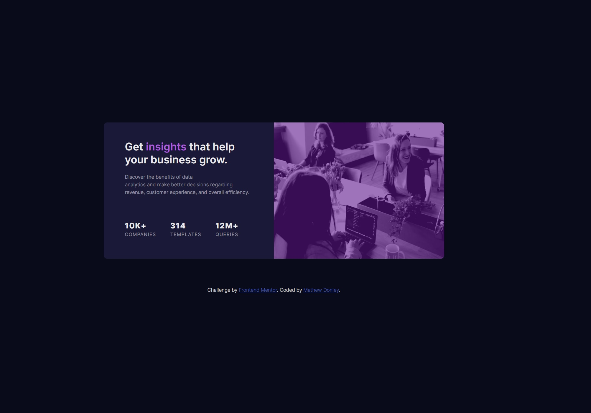

# Frontend Mentor - Stats preview card component solution

This is a solution to the [Stats preview card component challenge on Frontend Mentor](https://www.frontendmentor.io/challenges/stats-preview-card-component-8JqbgoU62). Frontend Mentor challenges help you improve your coding skills by building realistic projects.

## Table of contents

- [Overview](#overview)
  - [The challenge](#the-challenge)
  - [Screenshot](#screenshot)
  - [Links](#links)
- [My process](#my-process)
  - [Built with](#built-with)
  - [What I learned](#what-i-learned)
  - [Continued development](#continued-development)
  - [Useful resources](#useful-resources)
- [Author](#author)
- [Acknowledgments](#acknowledgments)

## Overview

A simple website card featuring some text, some stats and an image.

### The challenge

Users should be able to:

- View the optimal layout depending on their device's screen size

### Screenshot




### Links

- Solution URL: [My Soltion](https://github.com/MatCre/FrontEnd-Master-Stats-Preview-card-Component)
- Live Site URL: [Live Sit](https://matcre.github.io/FrontEnd-Master-Stats-Preview-card-Component/)

## My process

I started with the mobile design, began with getting the content onto the page so began writting the html markup. My inital
thought was that the card had three parts, the image, some text, and some stats. so creating three divs and putting the content
inside seemed like a good solution.

Then moved to the layout using flex propeties and text align and padding and margin to line up the and shape the inner card and
importantly give the text some breathing room.

Then matches the font sizes in proportion to the template design.

Then styling with colour, using some CSS variables.

For a while I was trying to use background-image css to load the image but when it came to setting a height for the container
without javascript there was no way in terms of scaling how to set the height for the container so I went back and swapped it for
an image tag inside a container much easiser i think.

### Built with

- Semantic HTML5 markup
- CSS custom properties
- Flexbox
- CSS Grid
- Mobile-first workflow

### What I learned

The way to add the purple filter I had to hack to adjust becuase i think the image was maintaing its aspect ratio on 100%
width and so using the ::after trick to add the purple overlay was covering the box and not the image. I got stuck for a while
here and I dont think my solution is good at all I need to work on my image sizing.

```css
.image_container::after {
  position: absolute;
  content: "";
  top: -3px;
  left: 0;
  width: 100%;
  height: 100%;
  z-index: 0;
  background-color: var(--primary-accent-transparent);
}
```

### Continued development

To begin with i think planning the elements themselves and also any css variables that will get reused. Lining things up post styling in relation to each other isn't efficient and with variables like --mobile-padding / --desktop-padding this would have made this easeier.

### Useful resources

## Author

- Website - [Add your name here](https://www.your-site.com)
- Frontend Mentor - [@yourusername](https://www.frontendmentor.io/profile/yourusername)
- Twitter - [@yourusername](https://www.twitter.com/yourusername)

## Acknowledgments
